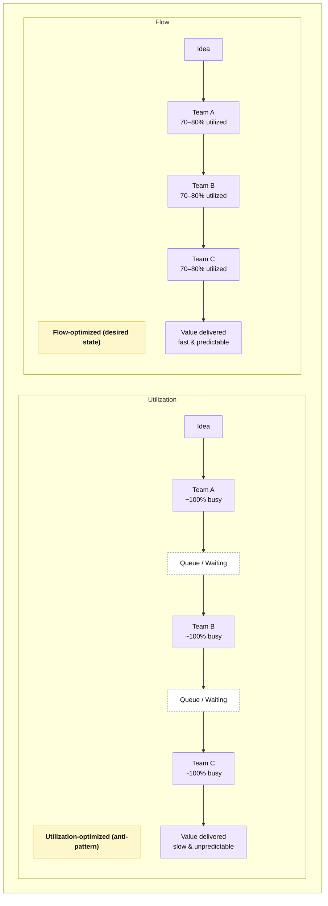

# Optimize For Flow, Not Utilization

## The Principle

Optimize for the flow of value through the system, not the utilization of individual teams, tools, or platforms.

High utilization **feels efficient** locally, but at the system level it **increases queues**, **delays feedback**, and **amplifies risk**. Sustainable delivery comes from improving flow, not keeping every component busy.

⸻

## Why This Principle Exists

### Visual: Flow vs Utilization

*Reason:* Queues are the hidden tax of “everyone busy”; flow improves when we preserve slack at key bottlenecks.

Most large organizations unintentionally optimize for utilization:
- fully allocated teams
- saturated CI/CD systems
- tightly packed release schedules
- “no idle capacity” cost controls

While well-intentioned, this creates systemic friction:
- longer lead times
- unpredictable delivery
- slower incident recovery
- higher security and operational risk

As utilization approaches 100%, queues grow non-linearly and delivery time explodes. This is a well-understood effect in queuing theory and a recurring pattern in DevOps research and large-scale systems.

**Flow, not effort, determines outcomes**.

⸻

## What “Flow” Means in Practice

Flow describes how quickly and predictably work moves from idea to value:

idea → commit → test → deploy → feedback → learning

Healthy flow is visible through:
- lead time for change
- cycle time
- deployment frequency
- time to restore service
- wait states between steps

Flow exposes constraints. Utilization hides them.

⸻

## Common Anti-Patterns

Organizations that optimize for utilization often experience:
- Platform teams with months-long queues despite being “fully staffed”
- CI systems overloaded during peak hours but idle overnight
- Security and compliance reviews batching work into large delays
- Release calendars full, yet value delivery slow
- Teams constantly “busy” while customers wait

These are not productivity problems — they are flow problems.

⸻

## Metrics as Decision Support (Not Scorecards)

Bad question:

“Why is this team underutilized?”

Better question:

“Where is the constraint limiting flow, and what investment removes it?”

When flow is the goal, metrics are used to:
- identify bottlenecks
- justify capacity buffers
- sequence improvement work
- guide architectural investment

Not to evaluate individual performance.

⸻

## Example: Platform Enablement Constraint

Signal
- Environment provisioning takes 3–4 weeks

Utilization-driven response
- Increase ticket throughput
- Add approvals
- Push teams to multitask

Flow-driven response
- Recognize provisioning as the system constraint
- Invest in self-service infrastructure (IaC)
- Reduce batch size and handoffs
- Add capacity where queues form

Outcome
- Shorter lead times
- Improved security and consistency
- Higher team autonomy
- Fewer escalations and manual interventions

⸻

## Why This Matters at Scale

Optimizing for flow is foundational to:
- DevOps and platform engineering
- cloud architecture and cost tradeoffs
- reliability and resilience
- progressive delivery and release on demand

High-performing organizations intentionally preserve slack in critical systems to maintain speed, quality, and safety.

⸻

## Key Takeaway

Utilization measures local efficiency. Flow determines system performance.

Leaders who optimize for flow create organizations that deliver faster, recover quicker, and learn continuously — even at enterprise scale.
